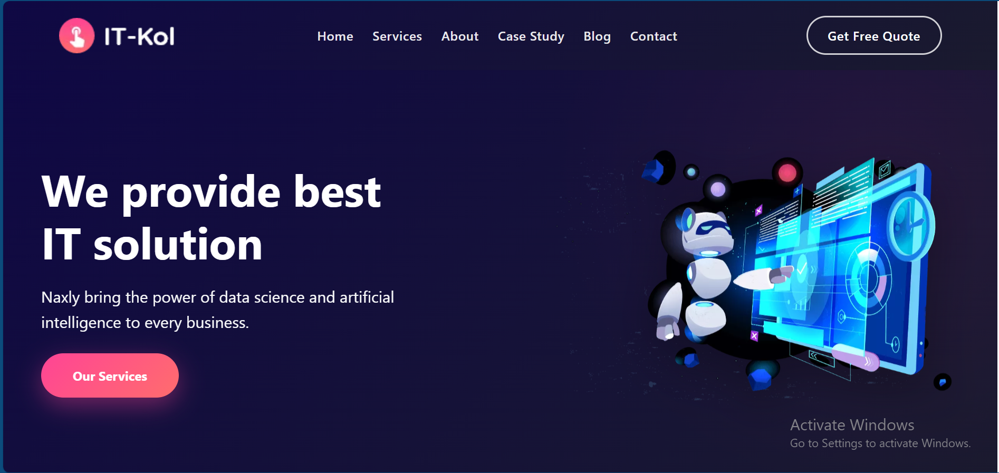
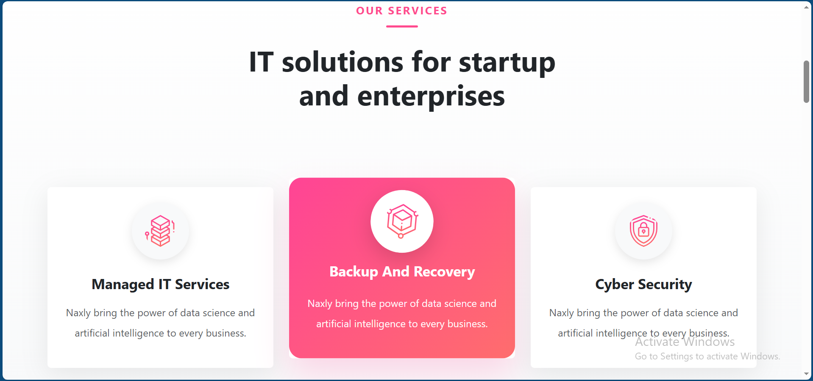
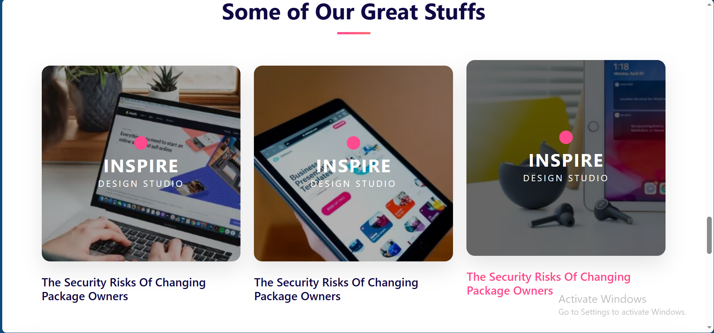

# IT-Kol


## Live Demo
[IT-Kol Live](https://sarah2-web.github.io/IT-Kol/)

## About the Project
IT-Kol is an IT services website featuring multiple sections such as:
- Available services
- News and updates
- Media gallery

Built with:
- HTML
- CSS
- Bootstrap
- JavaScript

## Features
- Responsive Design
- Navigation Menu
- Services Section
- Media Gallery
- News Section
## Screenshots

### Homepage


### Services Section


### Inspire Section



## Installation / Usage
To run the project locally:
1. Clone the repository:
```bash
git clone https://github.com/sarah2-web/IT-Kol.git
